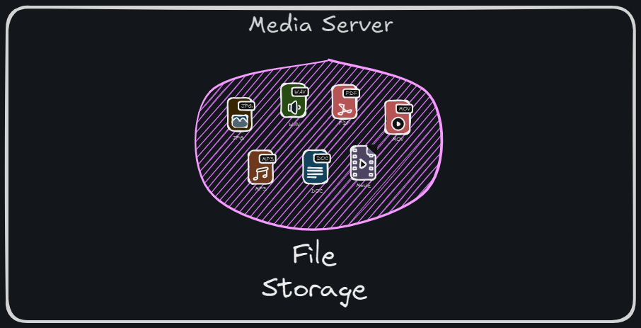

# Media Server  
**Part of the Video Search Engine Project**  

The Media Server is a Flask-based microservice designed for handling the storage and retrieval of media files. This service acts as the backbone for managing video files in the Video Search Engine project, providing APIs to upload and fetch files efficiently.



## Key Features  

- **File Upload**: Allows users to upload video files and stores them in a structured directory.  
- **File Retrieval**: Fetches video files by name, supporting seamless media access.  
- **Database Integration**: Manages metadata for uploaded videos using MySQL.  
- **Modular Design**: Integrates easily with other microservices in the system.  


## Installation  
### Prerequisites
- Python 3.12  
- MySQL server, with predefined table structure (MYSQL_DUMP.sql) loaded for metadata storage

### Steps  
1. Clone the repository:  
    ```bash  
    git clone https://github.com/iam-VK/media_server
    cd media_server
    ```  

2. Install the dependencies:  
    ```bash  
    ./setup.sh  
    ```  

3. Run the Flask application:  
    ```bash  
    ./run.sh  
    ```  

4. The service will be available at `http://localhost:5004`.  


## API Endpoints  

### 1. Service Status  
- **URL**: `/`  
- **Method**: GET or POST  
- **Description**: Returns the status of the service along with available endpoints.  
- **Response**:  
    ```json  
    {  
        "Status": "Alive",  
        "End-points": {  
            "/add_video": {  
                "method": "POST",  
                "file_upload": "<media file>",  
            },  
            "/get_video": {  
                "method": "POST",  
                "file_name": "<file name to be retrieved>",  
            }  
        }  
    }  
    ```  

### 2. Upload Video  
- **URL**: `/add_video`  
- **Method**: POST  
- **Description**: Uploads a media file and stores it on the server.
- **Request Parameters**:
    - `file_upload`: Video file to be uploaded.
- **Response**:
    ```json
    {
        "status": "SUCCESS",
        "request_method": "POST",
        "response": {
            "module": "add_video",
            "service": "media server",
            "status": "SUCCESS"
        }
    }
    ```  

### 3. Retrieve Video  
- **URL**: `/get_video`
- **Method**: POST  
- **Description**: Retrieves a video file by its name.  
- **Request Parameters**:  
    - `file_name`: Name of the video file to retrieve.  
- **Response**:  
    - Returns the requested video file if found.  


## Database Integration  

The Media Server uses a MySQL database to manage metadata for uploaded video files.  

### Metadata Schema:  
- `file_id` (Primary Key): Unique identifier for each video.
- `file_name`: Name of the uploaded video file.  
- `file_path`: Path where the video file is stored.
- `index_state`: Stores the index state of the file.
    - None (DEFAULT)
    - vision
    - speech
    - vsn-sph


## Benefits  

- **Reliable Media Management**: Efficient handling of media uploads and retrievals.  
- **Database-Backed Metadata**: Ensures consistent and searchable file storage.  
- **Scalable Design**: Supports integration with other microservices.  


This service is a fundamental component of the Video Search Engine project, providing the backbone for managing media files effectively and securely.